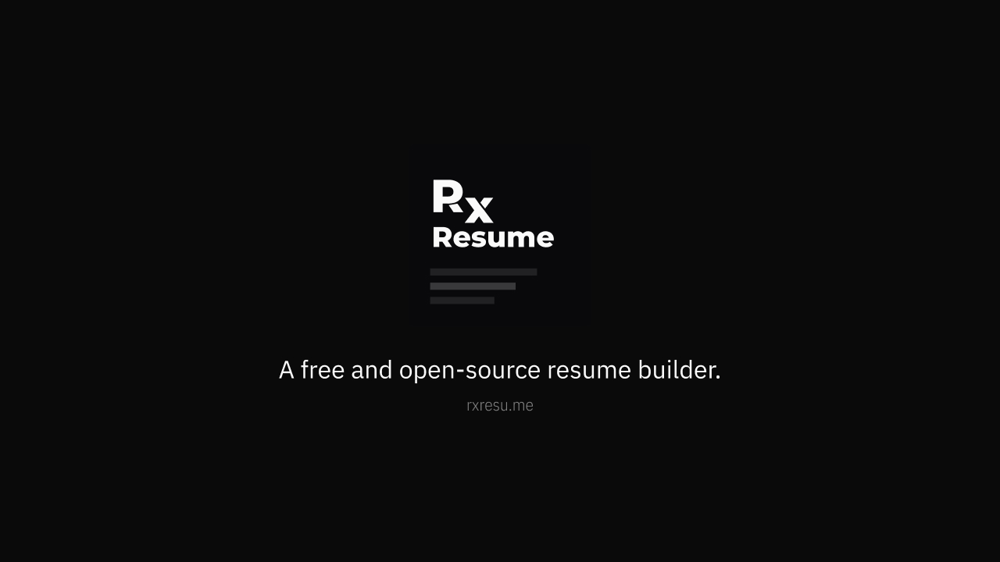
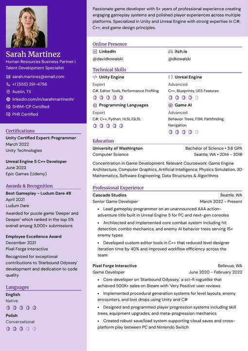
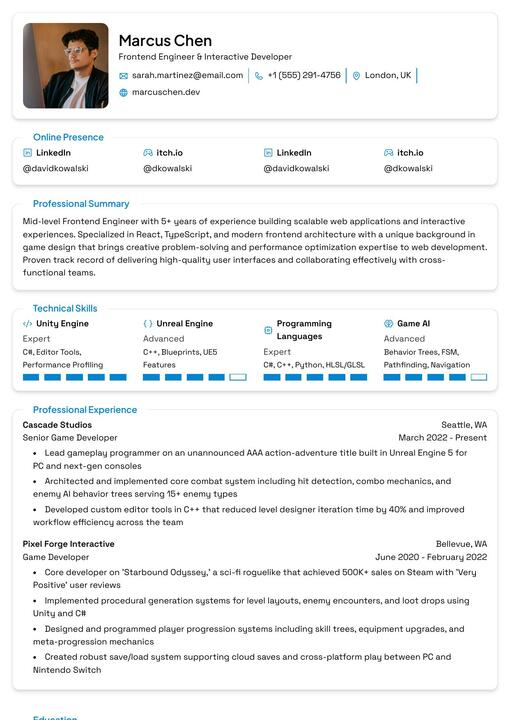

  

  <h1>UdaanResume</h1>

  
UdaanResume is a comprehensive, free resume builder built by UdaanIQ that simplifies the process of creating, updating, and sharing your resume.

  

    <strong>Built by UdaanIQ</strong>
  

---

UdaanResume makes building resumes straightforward. Pick a template, fill in your details, and export to PDF—no account required for basic use.

Built with privacy as a core principle, UdaanResume gives you complete ownership of your data. The codebase is MIT licensed, with no tracking, no ads, and no hidden costs.

## Features

**Resume Building**

- Real-time preview as you type
- Multiple export formats (PDF, JSON)
- Drag-and-drop section ordering
- Custom sections for any content type
- Rich text editor with formatting support

**Templates**

- Professionally designed templates
- A4 and Letter size support
- Customizable colors, fonts, and spacing
- Custom CSS for advanced styling

**Privacy & Control**

- No tracking or analytics by default
- Full data export at any time
- Delete your data permanently with one click

**Extras**

- AI integration
- Multi-language support
- Share resumes via unique links
- Import from JSON Resume format
- Dark mode support
- Passkey and two-factor authentication

## Templates

<table>
  <tr>
    <td align="center">
      
       <b>Azurill</b>
    </td>
    <td align="center">
      
       <b>Bronzor</b>
    </td>
    <td align="center">
      
       <b>Chikorita</b>
    </td>
    <td align="center">
      
       <b>Ditto</b>
    </td>
  </tr>
  <tr>
    <td align="center">
      
       <b>Gengar</b>
    </td>
    <td align="center">
      
       <b>Glalie</b>
    </td>
    <td align="center">
      
       <b>Kakuna</b>
    </td>
    <td align="center">
      
       <b>Lapras</b>
    </td>
  </tr>
</table>

## Tech Stack

| Category         | Technology                           |
| ---------------- | ------------------------------------ |
| Framework        | TanStack Start (React 19, Vite)      |
| Runtime          | Node.js                              |
| Language         | TypeScript                           |
| Database         | PostgreSQL with Drizzle ORM          |
| API              | ORPC (Type-safe RPC)                 |
| Auth             | Better Auth                          |
| Styling          | Tailwind CSS                         |
| UI Components    | Radix UI                             |
| State Management | Zustand + TanStack Query             |

## License

[MIT](./LICENSE) — do whatever you want with it.
